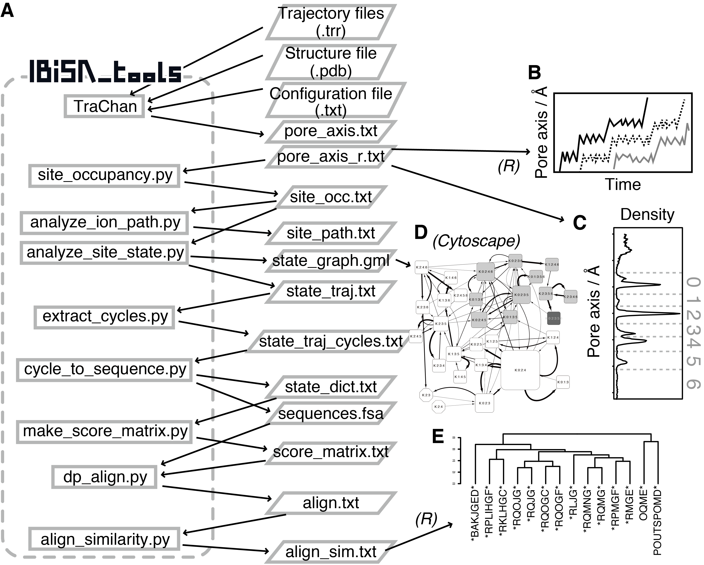

=======================
Overview
=======================

IBiSA_tools, which stands for "Ion Binding State Analysis tools", provides a computational tools for analyzing ion conduction mechanisms hidden in the molecular dynamics (MD) trajectory data. This analysis provides a varitery of information about each ion conduction event and overall properties. See the citations for details of theory and applications.

A list of programs contained in *IBiSA_tools* (the left column in A) and the default names of input/output files (the right column in B) are summarized. The panels B, C, D, and E are schematic image of output figures.

