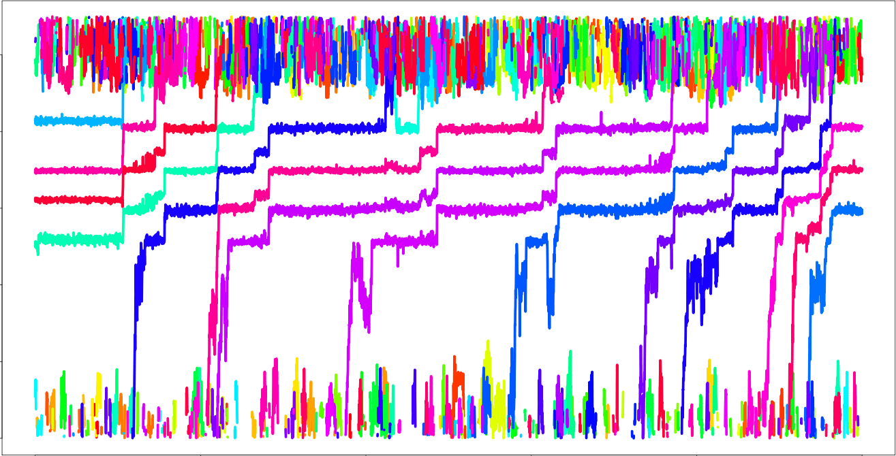
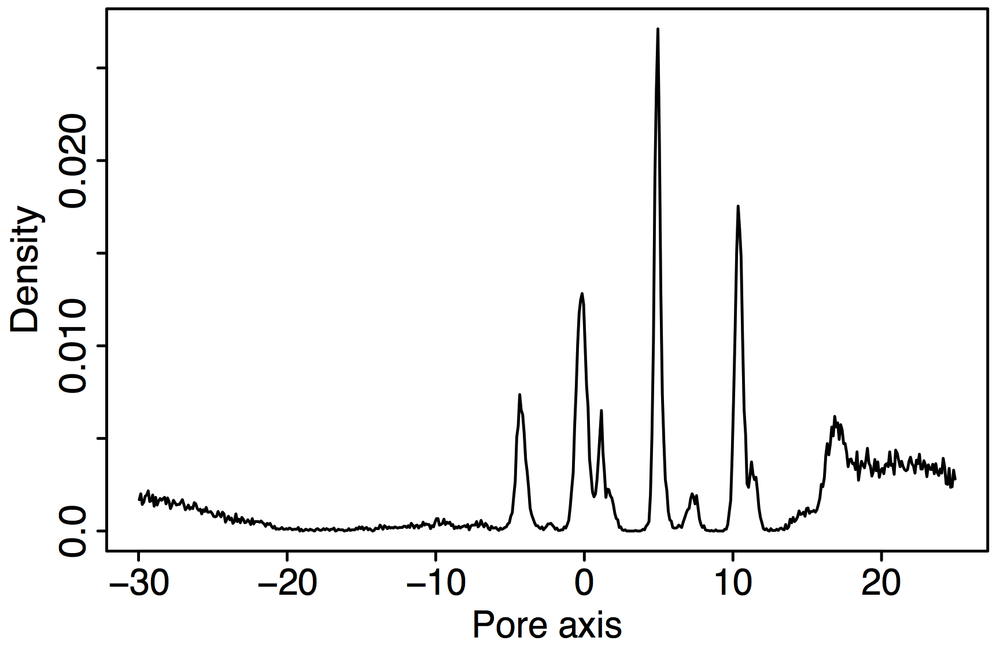
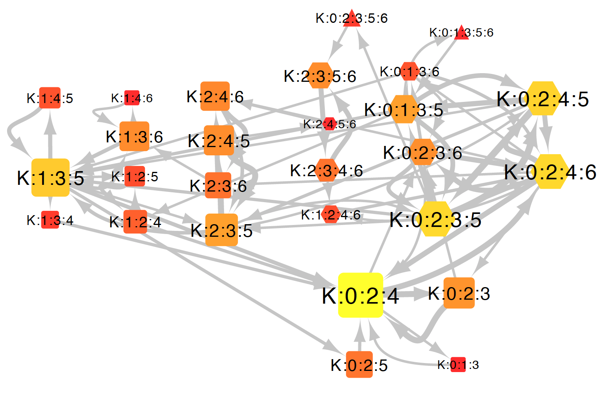
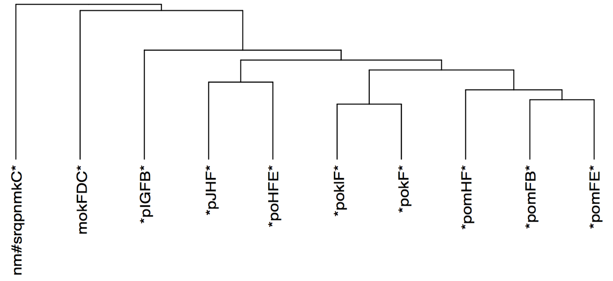

=======================
Tutorial
=======================

Setting the path to IBiSA_tools
-------------------------------------------------------------------------
::

  export IBISA="${HOME}/local/IBiSA_tools"

Set your own install directory.

Preparing the configuration file
-------------------------------------------------------------------------

config.txt::

  --fn-pdb                      init.pdb
  --dt                          10
  --site-boundary               20.0
  --site-boundary              -25.0
  --fn-pore-axis-coordinates    pore_axis.txt
  --fn-pore-axis-coordinates-r  pore_axis_r.txt
  --pore-axis-basis-from        A 374 O
  --pore-axis-basis-from        B 374 O
  --pore-axis-basis-from        C 374 O
  --pore-axis-basis-from        D 374 O
  --pore-axis-basis-to          A 377 O
  --pore-axis-basis-to          B 377 O
  --pore-axis-basis-to          C 377 O
  --pore-axis-basis-to          D 377 O
  --site-max-radius           10.0
  --site-height-margin         5.0
  --channel-chain-id          ABCD
  --trace-atom-name           K
  --fn-trr traj.trr

Each line indicate a set of key and values.

* *--fn-pdb* is the initial structure file.
* *--dt* is the time step of the trajectory file
* *--site-boundary* is specified two values, 20.0 and -25.0. This setting means that the range from 20.0 to -25.0 in the pore axis will be analyzed. The origin of the pore axis is set by *--pore-axis-basis-from* key.
* *--fn-pore-axis-coordinates* and *--fn-pore-axis-coordinates-r* are the output file names.
* *--pore-axis-basis-from* specifies the origin of the pore axis. "A 374 O" means the O atom in the residue 374 of the chain A. In this tutorial, four oxigen atoms are specified. The center of these atoms is set to be the origin of the pore axis.
* *--pore-axis-basis-to* defines the direction of the pore axis. The line from the center of *...-from* to the center of *...-to* defines the pore axis.
* *--site-max-radius* is the maximum radius of ion channel pore.
* *--site-height-margin* is the margin length along the pore axis. In this case, the range from 20.0+5.0 to -25.0-5.0 will be analyzed.
* *--channel-chain-id* specifies chain IDs of a channel protein.
* *--trace-atom-name* specifies the atom name of target ions, defined in the .pdb file.
* *--fn-trr* is the file name of the trajectory. Multiple files can be specified.

Converting a trajectory into the pore axis coordinates
-------------------------------------------------------------------------
::

  $IBISA/bin/trachan --fn-cfg config.txt

Some text should appear in the standard output::

  -----------------------------------------------------------------
                        TraChan                                    
    TRAjectory analyzer for CHANnel pore axis                      
  -----------------------------------------------------------------
  Copyright (c) 2016 Kota Kasahara, Ritsumeikan University         
  This software is distributed under the terms of the GPL license  
                                                                   
  -----------------------------------------------------------------
  This program contains some parts of the source code of GROMACS
  software. Check out http://www.gromacs.org about GROMACS.        
  Copyright (c) 1991-2000, University of Groningen, The Netherlands
  Copyright (c) 2001-2010, The GROMACS development team at         
  Uppsala University & The Royal Institute of Technology, Sweden.  
  -----------------------------------------------------------------
  TraChan::mainRoutine()                                           
  site occupancy mode                                              
  n_atoms : 6997                                                   
  pore axis basis a                                                
  1014 O THR 374                                                   
  2735 O THR 374                                                   
  4456 O THR 374                                                   
  6177 O THR 374                                                   
  pore axis basis b                                                
  1058 O TYR 377                                                   
  2779 O TYR 377                                                   
  4500 O TYR 377                                                   
  6221 O TYR 377                                                   
  open pore_axis.txt                                               
  open pore_axis_r.txt                                             
  average axis length = 0.945331                                   
  sd axis length = 0.000977426 
  
And the two output files, *pore_axis.txt* and *pore_axis_r.txt* will be obtained. 

They are tab-separated text files. The first column indicates the time, and the other columns correspond to the coordinate of each potassium ion. Each row indicates the positions in each snapshot. *pore_axis.txt* and *pore_axis_r.txt* record the coordinates along the pore axis and those along the radial direction parpendicular to the pore axis.

Drawing a trajectory of ions along the pore axis
------------------------------------------------------------------------
::

  R --vanilla --slave < $IBISA/r/pore_axis_traj.R 

*pore_axis_traj.eps* shows the time course of ion coordinates.

Analyzing a histogram of ions
-------------------------------------------------------------------------

Histogram of ion frequency over the 2D pore axis space can be drawn by::

  python $IBISA/bin/ion_histogram.py \
    --i-pore-crd-h pore_axis.txt \
    --i-pore-crd-r pore_axis_r.txt \
    --o-histogram histogram.txt \
    --atomname K 
  
  R --vanilla --slave < $IBISA/r/histogram.R

*histogram.eps* is the 1D and 2D histogram of ions.

.. 
  .. image:: images/histogram.png
..

Analyzing the density distribution of ions along the pore axis
-------------------------------------------------------------------------
::

  R --vanilla --slave < $IBISA/r/pore_axis_density.R 

*density_distribution.eps* is the distribution plot.

This plot clearly shows localization of ions in the ion-binding sites. On the basis of this plot, we can define the boundary of each ion binding site.

Discretizing the trajectory based on ion-binding sites
-------------------------------------------------------------------------

Here, we use the definition which is determined in our previous reports. The boundaries of ion binding sites are  15.13, 12.93, 9.32, 6.25, 3.00, 0.44, -2.21, -6.08, and -20.::

  python $IBISA/bin/site_occupancy.py \
   --i-pore-crd-h pore_axis.txt \
   --i-pore-crd-r pore_axis_r.txt \
    --o-site-occ   site_occ.txt \
    --atomname K \
    -b 12.93 -b 9.32 -b 6.25 -b 3.00 -b 0.44 -b -2.21 -b -6.08  -b -20 \
    -n '-1'  -n 0     -n 1    -n 2    -n 3    -n 4    -n 5     -n 6 

The output file *site_occ.txt* records information about what ions are retained in each ion binding sites in each snapshot.

site_ooc.txt::

  0       1:6946:K        3:6985:K        4:6993:K        6:6935:K
  10      1:6946:K        3:6985:K        4:6993:K        6:6935:K
  20      1:6946:K        3:6985:K        4:6993:K        6:6935:K
  30      1:6946:K        3:6985:K        4:6993:K        6:6935:K
  40      1:6946:K        3:6985:K        4:6993:K        6:6935:K

"1:6956:K" means the ion K with the ID 6946 is bound at the site 1.

Analyzing the trajectories of each ion
-------------------------------------------------------------------------
::

  python ${IBISA}/bin/analyze_ion_path.py \
    --i-site-occ        site_occ.txt \
    --o-all-path        site_path.txt \
    --o-count-full      site_path_count_full.txt \
    --o-count-head-tail site_path_count_ht.txt 
    
The output *site_path.txt*::

  6985    K       *:3:0:* 0:7250  *:3:2:1:0:*     0:5290:5340:7240:7250                                                         
  6985    K       *:0:*   7320:7350       *:0:*   7320:7350                                                                     
  6985    K       *:0:*   7540:7570       *:0:*   7540:7570  

* The first column indicates the ID of the ion.
* At the third column, "*:3:0:*" means this ion got into the pore at site 3, and went out from the site 0.
* The fourth column denote the times for getting into and going out from the pore.
* The fifth column, "*:3:2:1:0:*" indicates the full trajectory of this ion from association the to pore and dissociation from the pore.

Each line corresponds to each event starting with an ion association and ending with a dissociation of that ion. The third and fourth columns are abbreviations of the fifth and sixth columns, respectively.

Generating the ion-binding state graph
-------------------------------------------------------------------------
::

  python $IBISA/bin/analyze_site_state.py \
    --i-site-occ site_occ.txt \
    --o-states   state_traj.txt \
    --o-graph    state_graph.gml \
    --atomname   K 

The ion binding state graph can be visualized by using the output file *state_graph.gml* with a network analysis software, e.g., Cytoscape.

*state_traj.txt* records the ion binding state in each snapshot::

  0       K:1:3:4:6       K:6946:6985:6993:6935
  10      K:1:3:4:6       K:6946:6985:6993:6935
  20      K:1:3:4:6       K:6946:6985:6993:6935
  30      K:1:3:4:6       K:6946:6985:6993:6935

The third column indicate the IDs of ions in the ion binding sites.

Extracting cyclic paths from the state trajectory
-------------------------------------------------------------------------
::

  python $IBISA/bin/extract_cycles.py \
    --i-state  state_traj.txt \
    --o-cycles state_traj_cycles.txt \
    --o-state-dict state_dict_pre.txt \
    --title    "sample" 

* option *--title* is an arbitrary string.

*state_traj_cycles.txt* stores the cyclic paths::

  >       1       6010    7830    sample
  6010    K:0:2:4 K:6985:6993:6935
  6630    K:0:2:4:6       K:6985:6993:6935:6961
  7190    K:0:2:4:5       K:6985:6993:6935:6961
  7230    K:0:1:3:5       K:6985:6993:6935:6961
  7820    K:1:3:5 K:6993:6935:6961
  7830    K:0:2:4 K:6993:6935:6961

* The line begining with ">" is the header line. The cyclic path "1" starts at 6010 and ends at 7830.

Converting states into characters. A cyclic parts transformed into a sequence::
-------------------------------------------------------------------------
::

  python $IBISA/bin/cycle_to_sequence.py \
    --i-cycles     state_traj_cycles.txt \
    --i-state-dict state_dict_pre.txt \
    --o-state-dict state_dict.txt \
    --o-sequence   sequences.fsa 

* *state_dict.txt* describes a correspondence between states and characters.
* *sequences.fsa* is the sequences of cyclic paths.

::

  > 0     0       *POMFB* 5       28990   31650   sample
  *POMFB* 
  > 1     0       *POMFE* 8       44310   45210   sample
  *POMFE* 
  > 2     0       *PJHF*  7       39280   42200   sample
  *PJHF* 
  > 3     0       *POKLF* 6       36850   38640   sample
  *POKLF* 

Assignments of characters for states can be modified by revising the file specified as --i-state-dict option. For clarity, the characters for the ion binding states with 4 ions are replaced with lower cases, and 5-ion state is "#".

state_dict.txt::

  K:2:3:6 I
  K:2:4:6 J
  K:0:1:3:5       k
  K:0:1:3:6       l
  K:0:2:3:5       m
  ..
  K:0:2:3:5:6     #

Then, re-do *cycle_to_sequence.py*::

  python $IBISA/bin/cycle_to_sequence.py \
    --i-cycles     state_traj_cycles.txt \
    --i-state-dict state_dict.txt \
    --o-sequence   sequences.fsa 

Generating score matrix of states
-------------------------------------------------------------------------
::

  python $IBISA/bin/make_score_matrix.py \
     --i-state-dict  state_dict.txt \
     --o-score       score_matrix.txt

For each pair of ion-binding states, when the two states are identical, the similarity score is 1.0. When the two states have the same number of ions, the score is 0.5. Otherwise, teh score is 0.0.

Performing the sequence alignment
-------------------------------------------------------------------------
::

  python $IBISA/bin/dp_align.py \
     --i-score-matrix score_matrix.txt \
     --i-sequence     sequences.fsa \
     --o-align        align.txt -a\
     --min-len   4 \
     -g 1.0 \
     -m 1.0 \
     --ignore *

* *-g* and *-m* are gap score and match scores, respectively.
* The output file *align.txt* shows the pairwise alignments

::

  > 2     3       0.0     2       0       *pJHF*  7       ...
  *pJH-F*
  *poklF*
  > 0     3       1.0     0       0       *pomFB* 5       ...
  *pom-FB*
  *poklF-*

Make the similarity matrix of cyclic paths
-------------------------------------------------------------------------
::

  python $IBISA/bin/align_similarity.py \
    --i-align     align.txt \
    --i-sequence  sequences.fsa \
    --o-sim       align_sim.txt \
    -g 1 -m 1

Clustering aligned sequences by using R
-------------------------------------------------------------------------
::

  R --vanilla --slave < $IBISA/r/clustering_seq.R 

